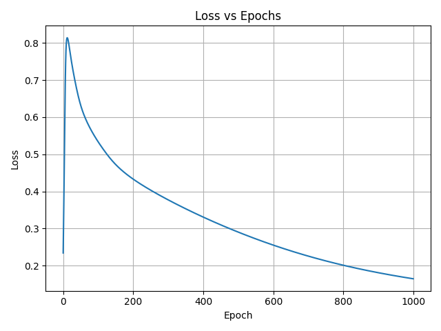
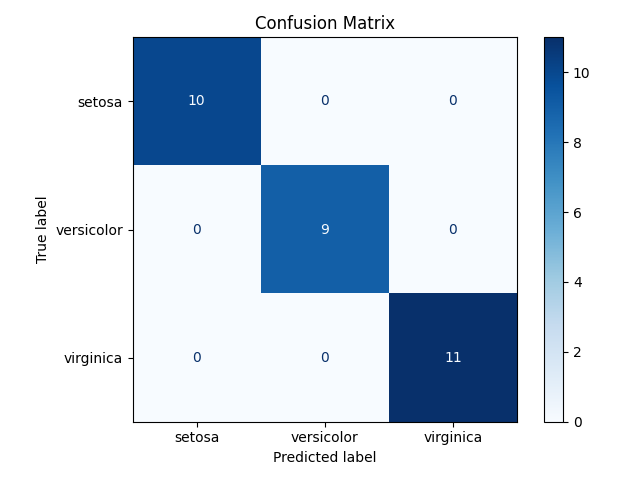

# Forward and Backward Propagation Neural Network

Bu proje kapsamında, sıfırdan yazılmış bir sinir ağı modeli ile Iris veri seti üzerinde sınıflandırma yapılmıştır. Projede hazır kütüphaneler kullanılmadan ileri (forward propagation) ve geri yayılım (backpropagation) algoritmaları manuel olarak uygulanmıştır. Eğitim süreci sırasında hata fonksiyonu (loss) takip edilerek modelin öğrenme başarımı gözlemlenmiştir.

---

## 📊 Kullanılan Veri Seti: *Iris Dataset*

- **Kayıt Sayısı:** 150
- **Sınıflar:** `setosa`, `versicolor`, `virginica`
- **Özellikler:** `sepal_length`, `sepal_width`, `petal_length`, `petal_width`

Iris veri seti, iyi dengelenmiş ve sınıflar arası ayrımın net olduğu bir yapıya sahiptir. Bu nedenle sınıflandırma algoritmalarının başarısını değerlendirmek için sıklıkla tercih edilir.

---

## 🧠 Model Mimarisi

- **Girdi Katmanı:** 4 nöron (özellik sayısı)
- **Gizli Katman:** 10 nöron
- **Çıkış Katmanı:** 3 nöron (sınıf sayısı)
- **Aktivasyon Fonksiyonu:** Sigmoid
- **Kayıp Fonksiyonu:** Cross Entropy
- **Öğrenme Oranı (Learning Rate):** 0.1
- **Epoch Sayısı:** 1000

---

## ⚙️ Eğitim ve Test Süreci

- Veri seti %80 eğitim, %20 test olarak ayrılmıştır.
- Eğitim sonrası model, test verisi üzerinde **%100 doğruluk (accuracy = 1.00)** elde etmiştir.
- Her 100 epoch’ta bir loss değeri yazdırılmış ve tüm epoch’lar boyunca loss kaydedilmiştir.

---

## 📈 Sonuçlar

### 🔻 Loss vs Epoch Grafiği
Modelin eğitim sürecindeki kayıp değerlerinin değişimi:



---

### 🔻 Karışıklık Matrisi
Test verisi sınıflandırmasında elde edilen doğruluk:



---

## ▶️ Projeyi Çalıştırmak

Aşağıdaki komut ile proje çalıştırılabilir:

```bash
python main.py
